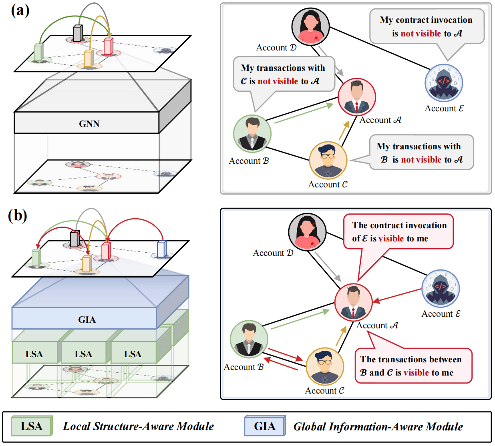
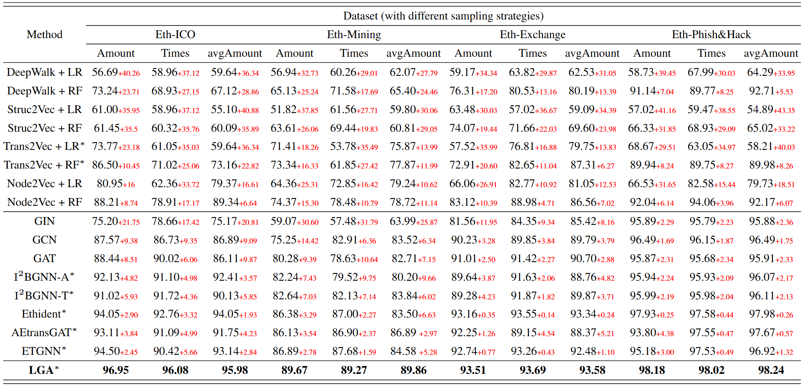
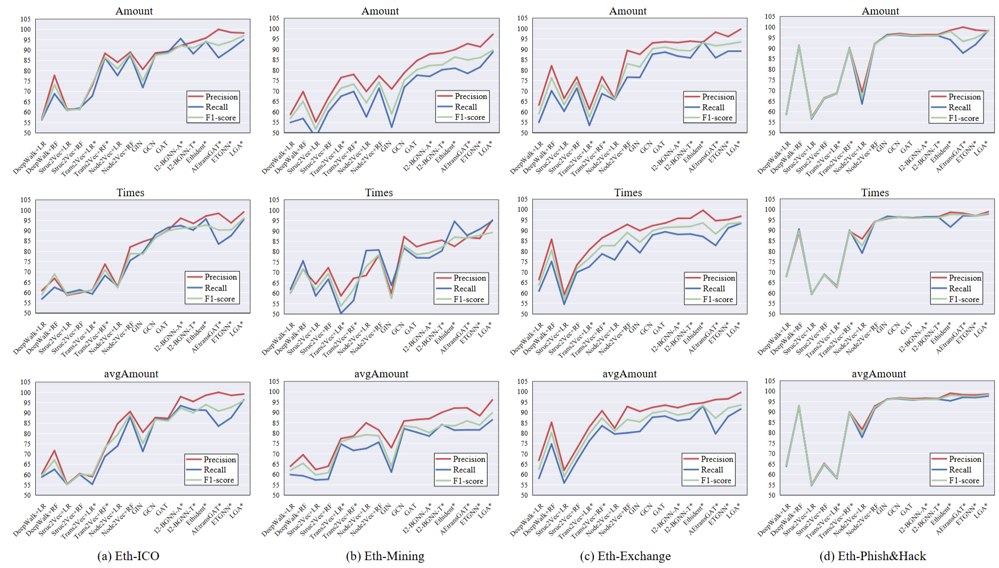

# Hierarchical Network with Local-Global Awareness for Ethereum Account De-anonymization


Official implementation of Hierarchical Network with Local-Global Awareness for Ethereum Account De-anonymization.

## Network Architecture



Comparison of our proposed Local-Global Awareness (LGA) framework with existing graph neural network frameworks for Ethereum account
de-anonymization. (a) Existing graph neural network methods encode only a
1-hop subtree around the target node, which limits their expressiveness and
fails to capture transactions between neighboring nodes or information from
nodes multiple hops away. (b) In contrast, LGA effectively identifies potential
transactions between neighboring nodes and expands the receptive field to
consider the entire graph, enabling the aggregation of information from all
nodes to the target node.

## Requirements

```
numpy
scipy
einops
ogb
scikit-learn==1.3.2
torch==2.1.0+cu118
torch-cluster==1.6.2+pt21cu118
torch-geometric==2.6.1
torch-scatter==2.1.2+pt21cu118
torch-sparse==0.6.18+pt21cu118
torch-spline-conv==1.2.2+pt21cu118
```

## Data Description
### lw_AIG dataset

Size: 5732 graphs, divided into four sub-datasets, Eth-ICO, Eth-mining, Eth-Exchange, Eth-Phish&Hack, with 146, 130, 386, 5070 graphs respectively.

Challenge: Challenge: The challenge on the lw-AIG dataset is to perform binary classification on all graphs in each sub-dataset.

Preparation:  Download lw_AIG dataset in PYG format from this [page](https://jjzhou.notion.site/Ethident-Data-861199675dc7454eb36157eeee09cf5b) and place it under the path 'datasets_lw_AIG/data/', and transform the datasets:
```
python data_transform.py
```

### Elliptic dataset

Size: 203,769 nodes and 234,355 edges

Challenge: The challenge on the Elliptic dataset is to classify the illicit and licit nodes in the graph.

Preparation: Download Elliptic dataset from this [page](https://www.kaggle.com/datasets/ellipticco/elliptic-data-set) and place it under the path 'datasets_elliptic/'.

## Benchmark
### lw_AIG dataset
Micro F1 score (%) comparisons with state-of-the-art methods for Ethereum account de-anonymization on the lw-AIG datasets. The performance metrics of our method are highlighted in **bold**. Comparing the performance of different methods with LGA, the gaps over are recorded in red. * indicates a method designed specifically for the account de-anonymization task.

Comparison with state-of-the-art methods for Ethereum account de-anonymization on the lw-AIG dataset, reporting precision (%), recall (%), and F1 score (%). 


### Elliptic dataset


Illicit transaction classification results on the Elliptic dataset, reporting precision (%), recall (%), F1 score (%), and micro F1 score (%). The performance metrics of our method are highlighted in **bold**. Comparing the performance of different methods with LGA, the gaps over are recorded in red. * indicates a method designed specifically for the account de-anonymization task.


## Usage

### lw_AIG dataset
```
python train.py
```

### Elliptic dataset
```
python datasets_elliptic/train.py
```

## Visualization
Example graph and attention map retrieved from LGA. The vertical axis corresponds to the attention weights that the target node receives from other nodes, and the horizontal axis corresponds to the attention weights that a specific node allocates to other nodes. Attention weights sum to 1 on the horizontal axis. Nodes that receive more attention from other nodes are displayed in red, while nodes that receive less attention are displayed in blue.


